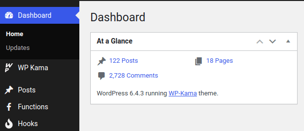
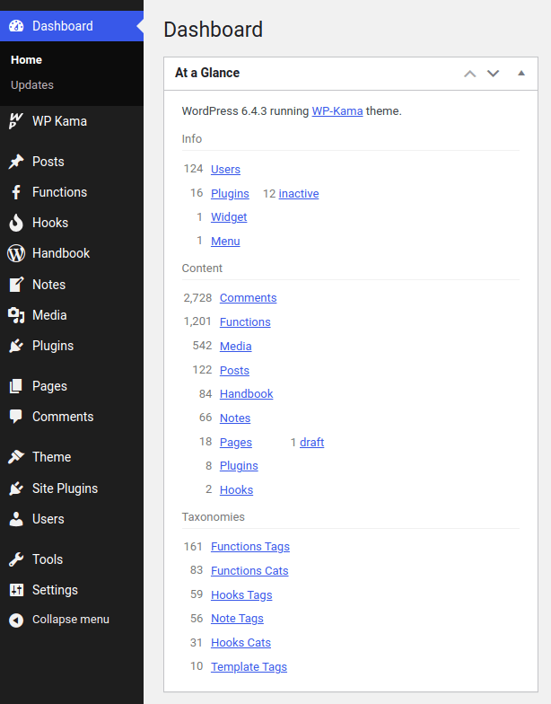

Kama Glance Dashboard Widget
============================

Enhance your dashboard experience with a more dynamic and relevant alternative to the standard "At a Glance" widget.

Tired of the limited insights provided by the default "At a Glance" dashboard widget? Look no further – "Kama Glance Dashboard Widget" is the solution.

While the original widget focuses on posts, pages, categories, tags, widgets, and comments, it may not suit the needs of every website. What if you don't use comments or have various custom post types?

Enter "Kama Glance Dashboard Widget", offering a comprehensive overview tailored to your site. It presents a precise snapshot of your public post types, taxonomies, active plugins, registered users, links, widgets, and menus – all organized by significance. If you don't utilize a specific feature, it won't clutter your view.

Key Features:

* The plugin works in admin area only.
* No setup required.
* Translation-ready.
* Adheres to strict permissions, ensuring users only access relevant information.
* Easily customizable using WP hooks.
* Preserves default WP widget hooks, enabling seamless integration with other plugins.

Screenshots
-----------

Before | After
---    | ---
 | 
